# Club Management System - Complete Flowcharts

## 📊 System Overview Flowchart

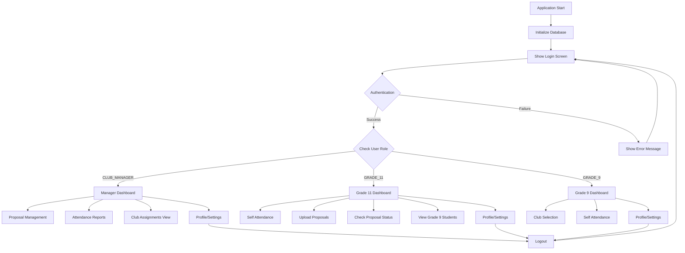

---

## 🔐 Authentication & Login Process

```mermaid
flowchart TD
    A[Login Screen] --> B[Enter Username/Password]
    B --> C[Click Login]
    C --> D[AuthenticationService.login()]
    D --> E[Query Database]
    E --> F{User Exists?}

    F -->|No| G[Show "Invalid Credentials"]
    G --> A

    F -->|Yes| H{Password Valid?}
    H -->|No| G
    H -->|Yes| I[Create User Session]
    I --> J[Update Last Login]
    J --> K{Check Role}

    K -->|CLUB_MANAGER| L[Load Manager Dashboard]
    K -->|GRADE_11| M[Load Grade 11 Dashboard]
    K -->|GRADE_9| N{First Login?}

    N -->|Yes| O[Show Setup Wizard]
    O --> P[Load Grade 9 Dashboard]
    N -->|No| P

    L --> Q[Show Main Interface]
    M --> Q
    P --> Q
```

---

## 👔 Manager Dashboard Flowcharts

### Manager Main Navigation
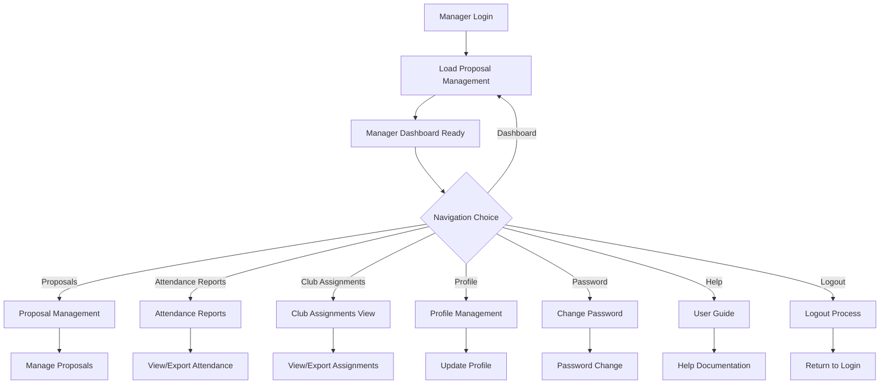

### Proposal Management Process
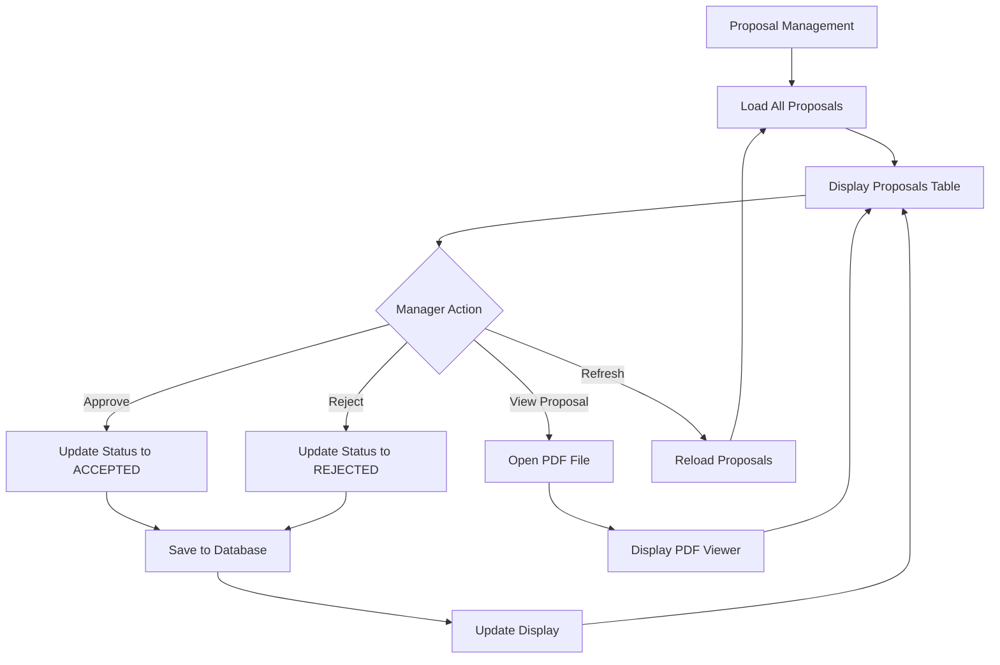

### Attendance Reports Process
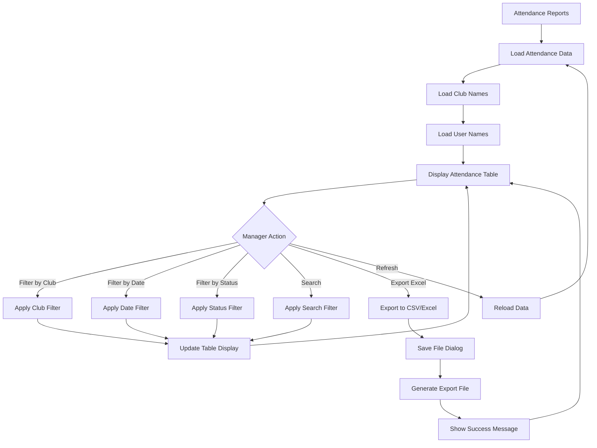

### Club Assignments View Process
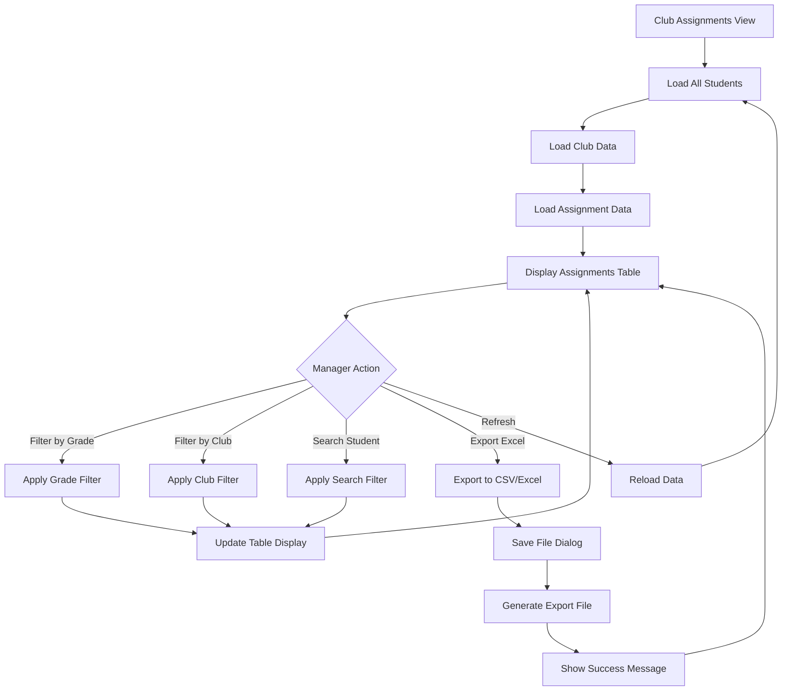

---

## 🎓 Grade 11 Student Dashboard Flowcharts

### Grade 11 Main Navigation
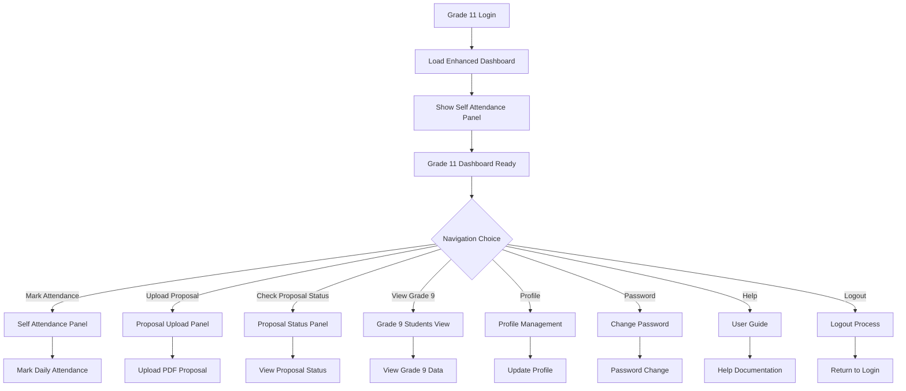

### Self Attendance Process
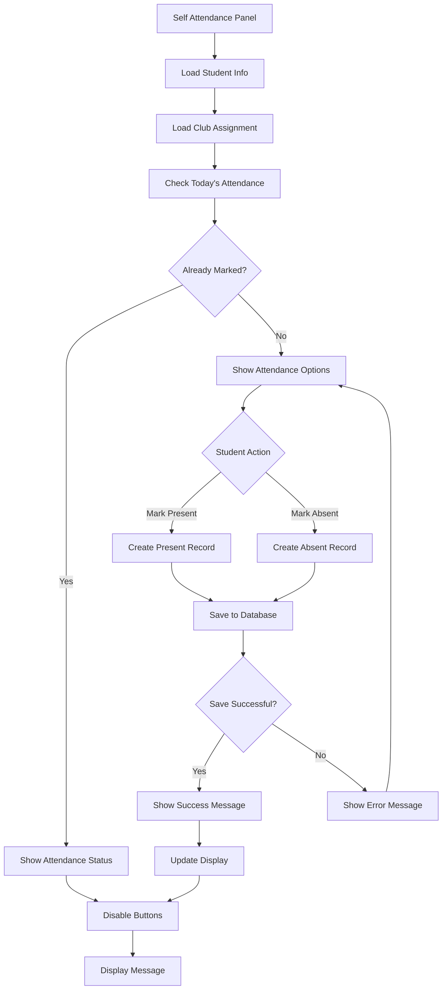

### Proposal Upload Process
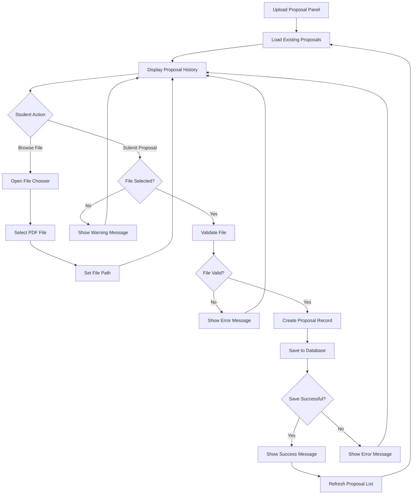

### Proposal Status Check Process
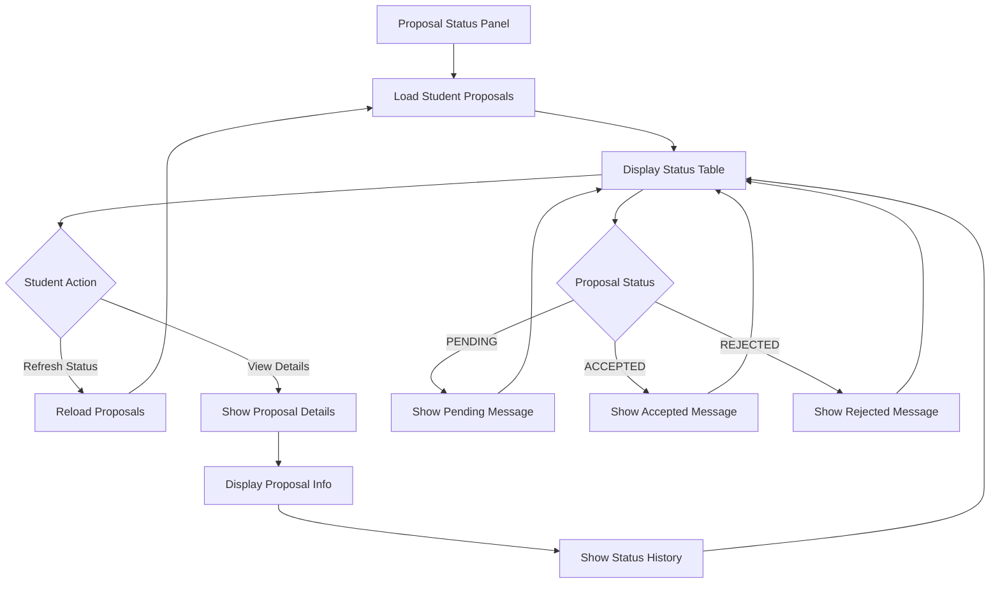

### Grade 9 Students View Process
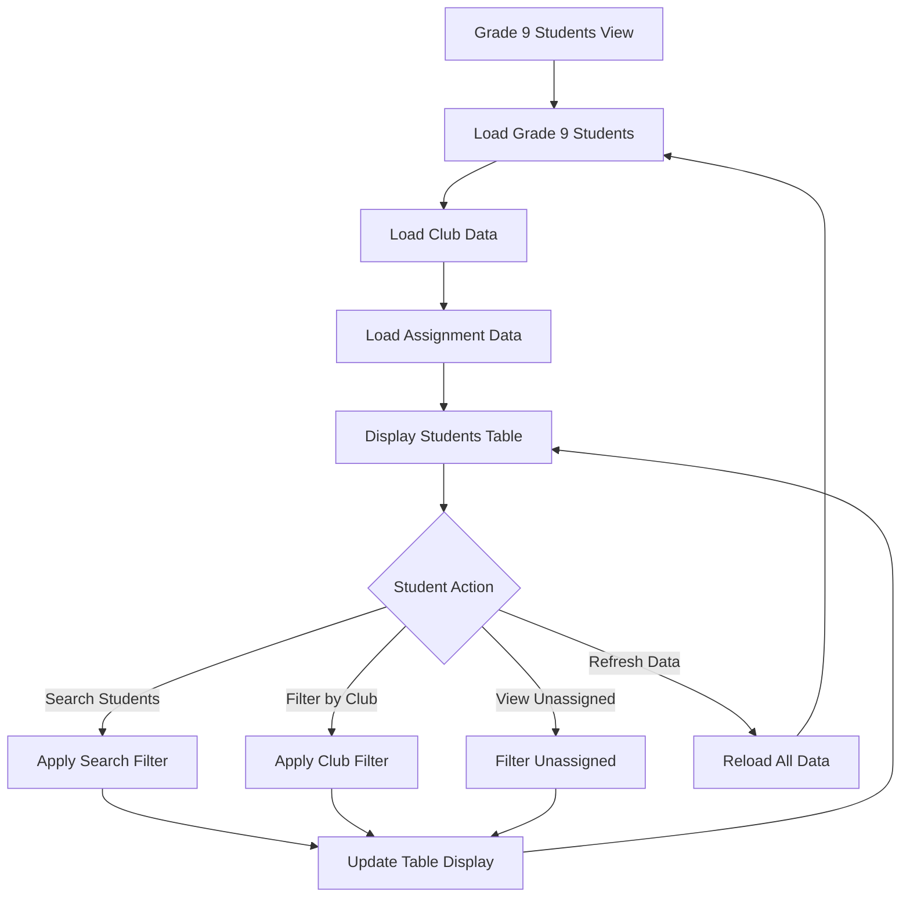

---

## 🎒 Grade 9 Student Dashboard Flowcharts

### Grade 9 Main Navigation
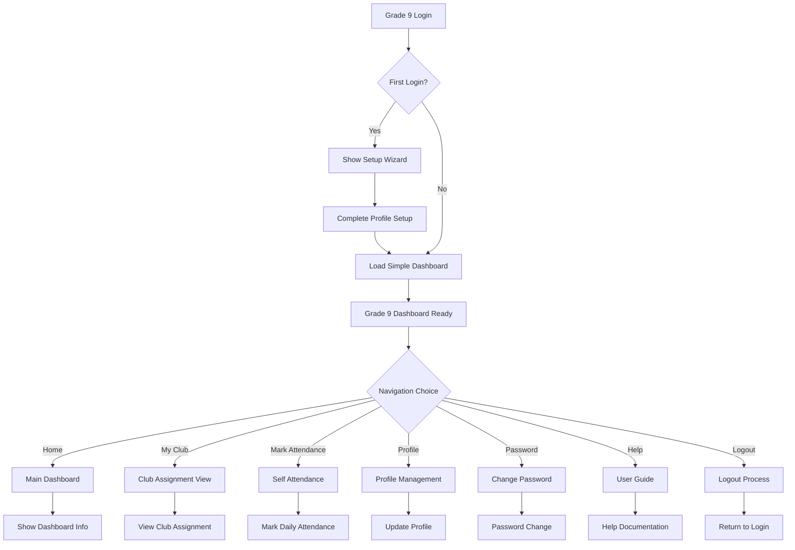

### Club Selection Process
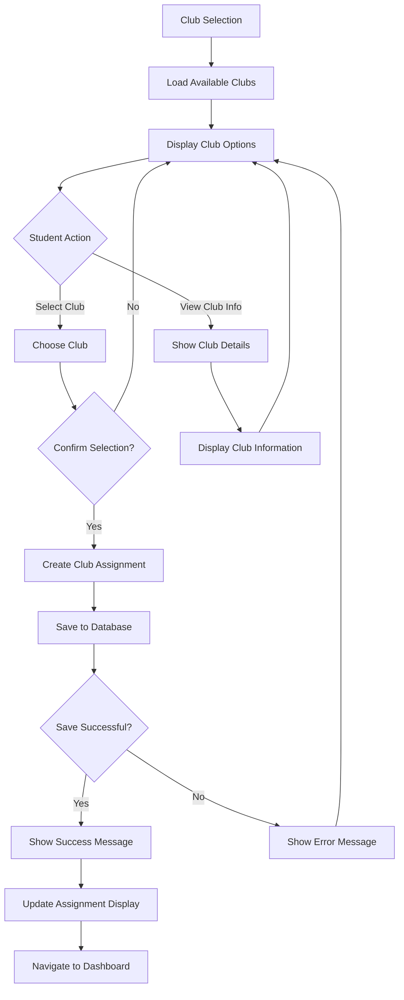

### Grade 9 Self Attendance Process
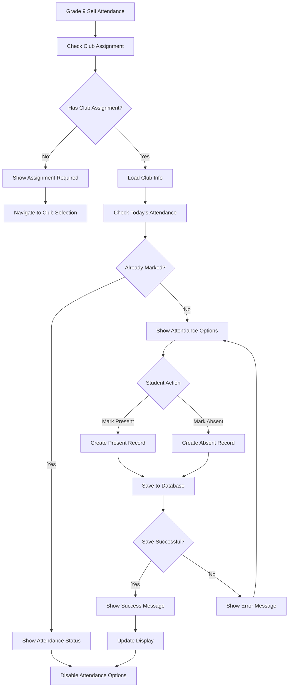

---

## 🗄️ Database Interaction Flowcharts

### User Authentication Database Flow
```mermaid
flowchart TD
    A[Login Request] --> B[UserDAO.authenticate()]
    B --> C[Query users Table]
    C --> D[SELECT * FROM users WHERE username = ?]
    D --> E{User Found?}

    E -->|No| F[Return null]
    F --> G[Authentication Failed]

    E -->|Yes| H[Check Password]
    H --> I{Password Valid?}

    I -->|No| F
    I -->|Yes| J[Update last_login]
    J --> K[Create User Session]
    K --> L[Insert into user_sessions]
    L --> M[Return User Object]
    M --> N[Authentication Success]
```

### Proposal Management Database Flow
```mermaid
flowchart TD
    A[Proposal Action] --> B{Action Type}

    B -->|Submit| C[ProposalDAO.insertProposal()]
    B -->|View All| D[ProposalDAO.getAllProposals()]
    B -->|View by Student| E[ProposalDAO.getProposalsByStudentId()]
    B -->|Update Status| F[ProposalDAO.updateProposalStatus()]

    C --> G[INSERT INTO proposals]
    D --> H[SELECT * FROM proposals]
    E --> I[SELECT * FROM proposals WHERE student_id = ?]
    F --> J[UPDATE proposals SET status = ?]

    G --> K[Return Success/Failure]
    H --> L[Return Proposal List]
    I --> L
    J --> K
```

### Attendance Management Database Flow
```mermaid
flowchart TD
    A[Attendance Action] --> B{Action Type}

    B -->|Mark Attendance| C[AttendanceDAO.markAttendance()]
    B -->|Get All Attendance| D[AttendanceDAO.getAllAttendance()]
    B -->|Get by Student| E[AttendanceDAO.getAttendanceByStudent()]
    B -->|Get by Date| F[AttendanceDAO.getAttendanceByClubAndDate()]

    C --> G[INSERT OR REPLACE INTO attendance]
    D --> H[SELECT * FROM attendance WITH JOINS]
    E --> I[SELECT * FROM attendance WHERE student_id = ?]
    F --> J[SELECT * FROM attendance WHERE club_id = ? AND session_date = ?]

    G --> K[Return Success/Failure]
    H --> L[Return Attendance Records]
    I --> L
    J --> L
```

### Club Assignment Database Flow
```mermaid
flowchart TD
    A[Club Assignment Action] --> B{Action Type}

    B -->|Allocate Student| C[ClubAllocationDAO.allocateStudentToClub()]
    B -->|Get All Allocations| D[ClubAllocationDAO.getAllAllocations()]
    B -->|Get by Student| E[ClubAllocationDAO.getAllocationByStudentId()]
    B -->|Get by Club| F[ClubAllocationDAO.getAllocationsByClubId()]

    C --> G[INSERT OR REPLACE INTO club_allocation]
    D --> H[SELECT * FROM club_allocation]
    E --> I[SELECT * FROM club_allocation WHERE student_id = ?]
    F --> J[SELECT * FROM club_allocation WHERE club_id = ?]

    G --> K[Return Success/Failure]
    H --> L[Return Allocation Records]
    I --> M[Return Single Allocation]
    J --> L
```

---

## 🔄 System State Transitions

### Application State Flow
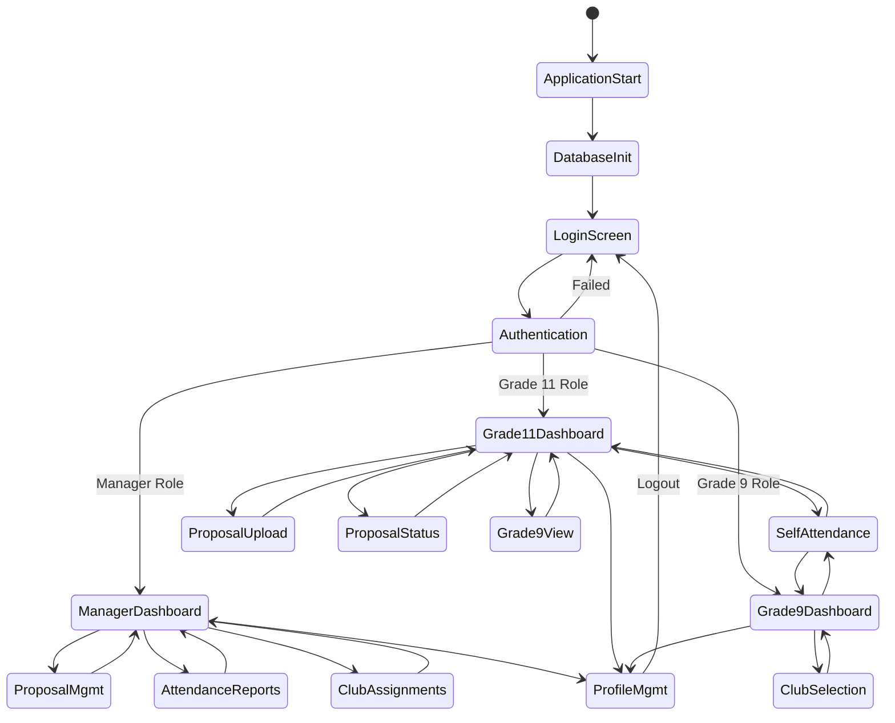

---

## 📋 Summary of System Processes

### Key System Features:
1. **Role-Based Access Control** - Different interfaces for Manager, Grade 11, and Grade 9 users
2. **Attendance Management** - Self-marking system for students with manager reporting
3. **Proposal System** - PDF upload and approval workflow
4. **Club Assignment** - Student self-selection with manager oversight
5. **Data Export** - Excel/CSV export capabilities for managers
6. **Real-time Updates** - Dynamic data loading and refresh capabilities

### Database Tables Used:
- **users** - User authentication and profile data
- **proposals** - Proposal submissions and status
- **attendance** - Attendance records
- **clubs** - Club information
- **club_allocation** - Student-club assignments
- **user_sessions** - Login session tracking
- **password_reset_tokens** - Password reset functionality

### Security Features:
- Password hashing with salt
- Role-based access control
- Session management
- Input validation
- File type validation for uploads